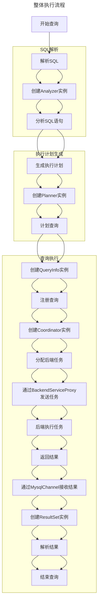
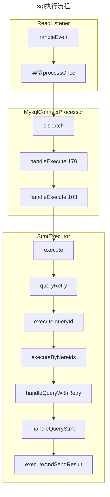

#### 代码引用：
1. src/main/java/org/apache/doris/qe/StmtExecutor.java
2. src/main/java/org/apache/doris/qe/MysqlConnectProcessor.java
3. src/main/java/org/apache/doris/mysql/ReadListener.java

#### 核心功能位置说明：
1. sql解析在[executeByNereids]调用 parseByNereids
2. logicalPlan是Command类型，在[executeByNereids]调用 ((Command) logicalPlan).run(context, this)
3. logicalPlan是非Command类型(查询)，在[executeByNereids]调用 planner.plan
4. 如果是强一致读取，非master的FE在逻辑计划执行之前会强制同步一次Journal，调用syncJournalIfNeeded
5. 执行计划生成在[executeByNereids]调用 planner.plan
6. explain在[handleQueryStmt]调用 planner.getExplainString
7. 查询执行在[executeAndSendResult]调用 coordBase.exec()
8. 从BE获取结果在[executeAndSendResult]调用 coordBase.getNext()
9. 查询结果发送给客户端在[executeAndSendResult]调用 channel.sendOnePacket
10. 查询缓存在[executeAndSendResult]调用 context.getEnv().getSqlCacheManager().tryAddBeCache
11. 审计日志写入在[handleExecute 103]调用 auditAfterExec

